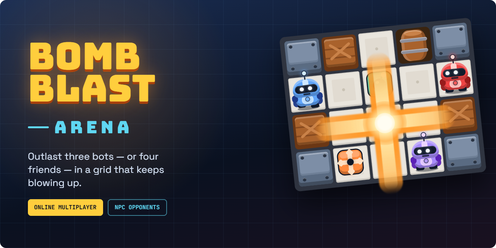
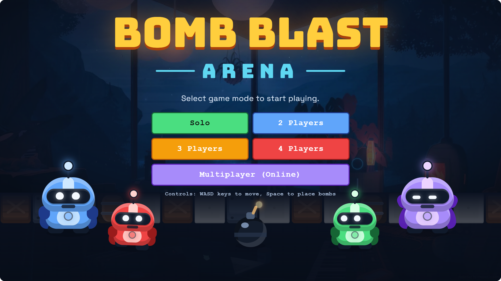
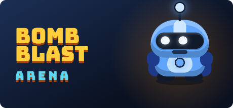

<div align="center">
  

  <br />

  
  
  
  
  

  <h3>A lo-fi love letter to the classic grid-bomber — right in your browser.</h3>
</div>

Drop bombs, blast barrels, grab power-ups, and be the last bot standing.
Play solo against up to three AI opponents, or take the chaos online with
friends through rooms, invite links, or a Discord Activity.

## ✨ Features

- 💣 **Classic bombing action** — destructible barrels, chain reactions, and timed fuses
- 🤖 **Smart AI opponents** — BFS-pathfinding bots that hunt, flee danger, and grab loot
- 🌐 **Online multiplayer** — host-authoritative matches over a tiny WebSocket relay, with 4-letter room codes and spectator support
- 💬 **Discord Activity** — rich presence, share-link invites, and join-from-Discord flow
- 🎁 **Power-ups** — extra bombs, bigger blasts, and more hidden in the rubble
- ⏱️ **Timed mode** — outscore the arena before the clock runs out

## 🎮 How to Play

<div align="center">
  
</div>

Pick a mode — **2–4 Players** (you versus AI bots) or **Multiplayer
(Online)** — and outlast everyone else in the arena.

| Action        | Keys                    |
| ------------- | ----------------------- |
| Move          | `WASD` or `Arrow Keys`  |
| Place bomb    | `Spacebar`              |
| Pause/Resume  | `Escape` (offline only) |

**Power-ups** hide under destroyed barrels: extra bombs, increased blast
range, and more.

## 🚀 Quick Start

Requirements: Node.js 26 and Yarn 4.

```bash
git clone https://github.com/Fluxpuck/bomberman.git
cd bomberman
yarn install
yarn dev
```

Visit `http://localhost:3000` and start playing!

## 🌐 Online Multiplayer

<div align="center">
  
</div>

Online multiplayer uses a separate WebSocket relay server. Start it in a
second terminal:

```bash
yarn ws
```

This runs the relay on `ws://localhost:3001` (override with `WS_PORT` env var).
For production hosting, point clients at your server with the
`NEXT_PUBLIC_WS_URL` environment variable (e.g. `wss://your-host:3001`).

To play online:

1. Click **Multiplayer (Online)** on the start screen.
2. Enter a nickname and **Create Room** — you'll get a 4-letter code.
3. Share the code. Other players enter it and click **Join**.
4. The host can optionally fill empty slots with bots, then clicks
   **Start Game**.

The host's browser runs the game engine and streams authoritative state to
guests; guests send their keyboard input back to the host. Online host
simulation uses a timer loop and guests resend held input periodically, but
browsers can still heavily throttle fully backgrounded tabs. Keep the host
window running for reliable matches. A future server-authoritative simulation
would remove this browser limitation. Pause is disabled in online games.

## 🛠️ Built With

- **Next.js 16** (App Router, Turbopack) + **React 19**
- **TypeScript** in strict mode
- **Tailwind CSS** for UI — the game itself is rendered with an imperative,
  `requestAnimationFrame`-driven DOM engine in `src/game/`
- **ws** for the multiplayer relay (`server/ws-server.js`)
- **Discord Embedded App SDK** for the Activity integration

## 📄 License

MIT — use freely and have fun!
